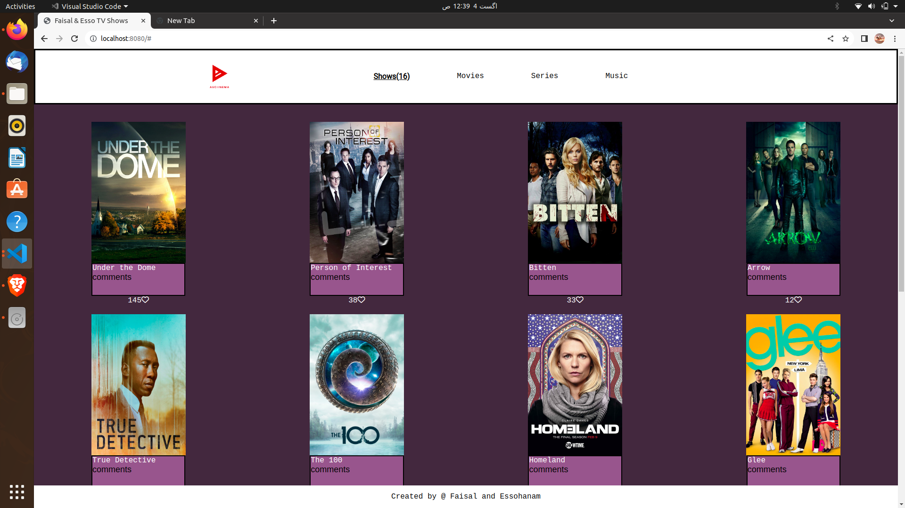
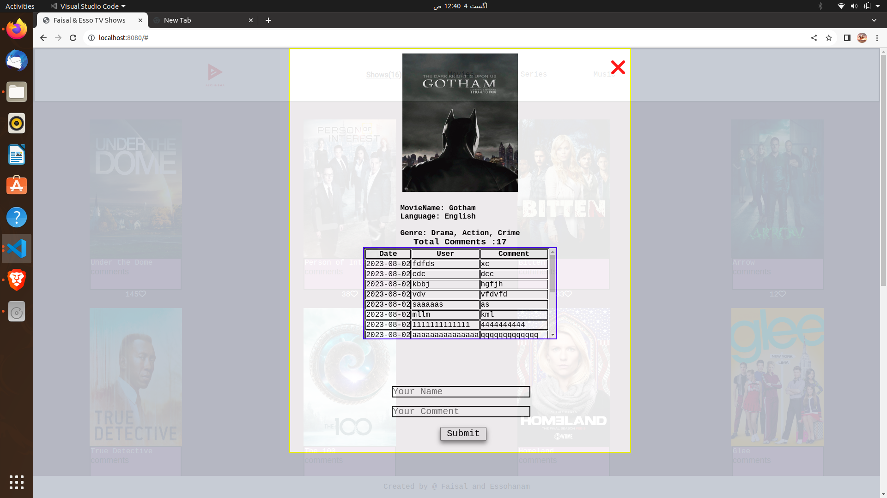

<a name="readme-top"></a>

<div align="center">

  <br/>
  
  <br/>
  <h3><b>Faisal-&-Esso-TV-Shows</b></h3>
</div>

<h1>Javascript group capstone project</h1>

# 📗 Table of Contents

- [📗 Table of Contents](#-table-of-contents)
- [📖 Faisal-\&-Esso-TV-Shows ](#-faisal--esso-tv-shows-)
    - [How to build the "Faisal-\&-Esso-TV-Shows" website](#how-to-build-the-faisal--esso-tv-shows-website)
- [Responsive website ](#responsive-website-)
  - [🛠 Walk through ](#-walk-through-)
  - [🛠 Built With ](#-built-with-)
    - [Tech Stack ](#tech-stack-)
    - [Tools ](#tools-)
    - [Key Features ](#key-features-)
  - [🚀 Live Demo ](#-live-demo-)
  - [🚀 Live Recording ](#-live-recording-)
  - [💻 Getting Started ](#-getting-started-)
    - [Prerequisites](#prerequisites)
    - [Setup](#setup)
    - [Install](#install)
    - [Usage](#usage)
    - [Run tests](#run-tests)
    - [Deployment](#deployment)
  - [Authors](#authors)
  - [🔭 Future Features ](#-future-features-)
  - [🤝 Contributing ](#-contributing-)
  - [⭐️ Show your support ](#️-show-your-support-)
  - [🙏 Acknowledgments ](#-acknowledgments-)
  - [📝 License ](#-license-)

# 📖 Faisal-&-Esso-TV-Shows <a name="about-project"></a>

Welcome to our website! Here, you can discover a vast collection of your favorite movies. If any movie catches your interest, simply click on the heart button to show your appreciation. Each movie listing features a clickable link for comments. By clicking on this link, a convenient popup window will appear, providing you with in-depth details about the specific movie.

You have the option to leave your own comments and feedback using the input field. Once you submit your comment along with your name and date, your message will be displayed at the bottom of the movie's page. The comment count will also increase accordingly, allowing for lively interactions among our users.

To ensure a seamless user experience, all of these activities are managed and processed through our meticulously designed APIs. These APIs facilitate the storage and retrieval of data, making your interactions on the website smooth and efficient.

For the implementation of this project, we are utilizing the following APIs:
Movie Database API: This API enables us to fetch and display detailed information about the movies in our collection, including their titles, genres, release dates, and more.

<p align="right">(<a href="https://www.tvmaze.com/api">TvMazeAPI</a>)</p>

User Comments API: This API handles the storage and retrieval of user comments, along with their associated metadata, such as names and timestamps. It ensures that all comments are securely recorded and readily accessible for future reference.

<p align="right">(<a href="https://microverse.notion.site/Involvement-API-869e60b5ad104603aa6db59e08150270">InvolvmentAPI</a>)</p>

By leveraging these powerful APIs, we are committed to providing you with an engaging and user-friendly movie-watching experience on our website. Enjoy exploring and interacting with your favorite movies!
<p align="center">
  
</p>
<p align="center">
  
</p>

<!-- > Describe your project in 1 or 2 sentences. -->

### How to build the "Faisal-&-Esso-TV-Shows" website

- 1. Use callbacks and promises.
- 2. Learn how to use proper ES6 syntax.
- 3. Use ES6 modules to write modular JavaScript.
- 4. Use webpack to bundle JavaScript.
- 5. Implementation of External API

# Responsive website <a name="about-project"></a>

This project is about creating a responsive website to showcase Movies List, Likes and comments. This is a implementation of SINGLE PAGE APPLICATION widely known as SPA.

Discover your favorite movies and show your appreciation by clicking the heart button. Each movie has a clickable comment link, which opens a popup window displaying more details. Leave your comments using the input field, and after submission, your message, name, and date will appear at the bottom. The comment count increases with each interaction. Actually this is a capstone project in the process of experiences mimic real-world projects where we must apply what we learned throughout the entire Module, and are built with business specifications that will look really nice in our portfolio. This is a Single Page Application project where in a single page all elements are called through JavaScript Dynamic programming.

## 🛠 Walk through <a name="walk-through"></a>

<ul>
  <li><a href="https://github.com/microverseinc/curriculum-javascript/blob/main/group-capstone/js_capstone.md">See the Project Requirement</a></li>
  <li>If required you should personalize the content of your page. Choose a topic that is different than the one in the original design</li>

**_API REQUIREMENTS_**

  <li><a href="https://www.tvmaze.com/api/">API Used</a></li>
</ul>
<li><a href="https://microverse.notion.site/Involvement-API-869e60b5ad104603aa6db59e08150270">Involvement API Used</a></li>
</ul>

## 🛠 Built With <a name="built-with"></a>

**_feature-One_**

- Imeplementation of Basic Framework linters error free.
- Implementation of <a href="https://github.com/microverseinc/curriculum-tools-copy-projects">Kanban Board</a>
- Implementation of <a href="https://github.com/microverseinc/curriculum-transversal-skills/blob/main/git-github/articles/gitflow.md">Gitflow</a>

**_feature-two_**

- Implementation of <a href="https://github.com/webpack/webpack">Webpack Framework</a>

**_feature-three_**

- We will create a Movie world Website for the visitor eloborating different options
- Choosing the <a href="https://www.tvmaze.com/api/">API</a>
- Choose images, text, icons, fonts.
- Set up the repository and tools has been done in feature-one, and feature-two

### Tech Stack <a name="tech-stack"></a>

<details>
  <summary>Client Side / Front-End</summary>
  <ul>
    <li><a href="https://www.w3.org/html/">HTML</a></li>
    <li><a href="https://www.w3.org/Style/CSS/">CSS</a></li>
    <li><a href="https://www.javascript.com/">Javascript</a></li>
  </ul>
</details>

<details>
  <summary>Server Side / Back-End</summary>
  <ul>
    <li><a href="https://www.json.org/json-en.html">JSON</a></li>
    <!-- <li><a href=""> - </a></li>
    <li><a href=""> - </a></li> -->
  </ul>
</details>

<!-- Features -->

### Tools <a name="tools"></a>

  <details>
    <summary>Code Convention, Code Analysis</summary>
      <ul>
        <li><a href="https://eslint.org/">ESLint</a></li>
        <li><a href="https://webhint.io/">Webhint</a></li>
        <li><a href="https://stylelint.io/">Stylelint</a></li>
        <li><a href="https://chrome.google.com/webstore/detail/lighthouse/blipmdconlkpinefehnmjammfjpmpbjk?hl=en">Lighthouse</a></li>
        <li><a href="https://www.npmjs.com/package/npm-check">node_modules checker</a></li>
      </ul>
  </details>
  <details>
    <summary>Version Control, CI/CD, Hosting Service</summary>
      <ul>
        <li><a href="https://pages.github.com/">Github Pages</a></li>
        <li><a href="https://github.com/features/actions">Github Actions</a></li>
        <li><a href="https://git-scm.com/">Git</a></li>
      </ul>
  </details>
  <details>
    <summary>IDE, Desktop Apps, Other Tools</summary>
      <ul>
        <li><a href="https://code.visualstudio.com/">Visual Studio Code</a></li>
        <li><a href="https://desktop.github.com/">Github Desktop</a></li>
        <li><a href="https://www.behance.net/">Behance</a></li>
        <!-- <li><a href="https://www.figma.com/">Figma</a></li> -->
      </ul>
  </details>

### Key Features <a name="key-features"></a>

- webpack 
- Button Interactions (i.e. hover, etc.)
- Attractive Images & Design
- Likes/Comments
- Dynamic page (data is retrieved from JSON file)

<p align="right">(<a href="#readme-top">back to top</a>)</p>

## 🚀 Live Demo <a name="live-demo"></a>

[Live Demo Link](https://faisalakb.github.io/Javascript-capston/dist/)

## 🚀 Live Recording <a name="live-demo"></a>

[The recording](https://drive.google.com/file/d/1267JBuQlm1FZi-uKGBSUqWSBA882vg8o/view?usp=sharing)

## 💻 Getting Started <a name="getting-started"></a>

To get a local copy up and running, follow these steps.

### Prerequisites

In order to run this project you need:

- git version 2.38.x
- node.js version > 12.x
- IDE
- browser (chrome, firefox, edge, safari)

### Setup

Clone this repository to your desired folder:

```sh
  cd Javascript-capston

  git https://github.com/faisalakb/Javascript-capston
```

### Install

Install this project with:

```sh
  cd Javascript-capston
  node npm install
```

### Usage

To run the project, execute the following command:
run live server

<!--
```sh
  rails server
```
-->

### Run tests

To run tests, run the following command:
Run Github Actions Test

```sh
  npx stylelint "**/*.{css,scss}"
  npx eslint .
  npm test
```

### Deployment

This project is deployed at github pages you can clone it here. [Please click to clone](coming soon)

<p align="right">(<a href="#readme-top">back to top</a>)</p>

## Authors

👤 **Faisal Mumtaz**

- GitHub: [@faisalakb](https://github.com/faisalakb)
- Twitter: [@faisalakb786](https://twitter.com/Faisalakb786)
- LinkedIn: [LinkedIn](https://www.linkedin.com/in/faisal-mumtaz-514a221a6/)


👤 **Essohanam TAMBANA**

- GitHub: [@GhostEsso](https://github.com/GhostEsso)
- Twitter: [@TambanaEssohanam](https://twitter.com/TambanaEssohana)
- LinkedIn: [@TambanaEssohanam](https://www.linkedin.com/in/essohanam-tambana-62aa081a1/)


<p align="right">(<a href="#readme-top">back to top</a>)</p>

## 🔭 Future Features <a name="future-features"></a>

- [ ] **Dynamic content.**
- [ ] **Add functionality of Javascript API**
- [ ] **Will add some background and beautification**

## 🤝 Contributing <a name="contributing"></a>

Contributions, issues, and feature requests are welcome!

Feel free to check the [issues page](https://github.com/faisalakb/Javascript-capston/issues).

<p align="right">(<a href="#readme-top">back to top</a>)</p>

## ⭐️ Show your support <a name="support"></a>

If you like this project give a star to this repositiory.

<p align="right">(<a href="#readme-top">back to top</a>)</p>

## 🙏 Acknowledgments <a name="acknowledgements"></a>

I would like to thank the Microverse full-stack curriculum for the inspiration and guidance.

<p align="right">(<a href="#readme-top">back to top</a>)</p>

## 📝 License <a name="license"></a>

This project is under [MIT](https://github.com/faisalakb/Javascript-capston/blob/development/LICENSE) licensed.

<p align="right">(<a href="#readme-top">back to top</a>)</p>